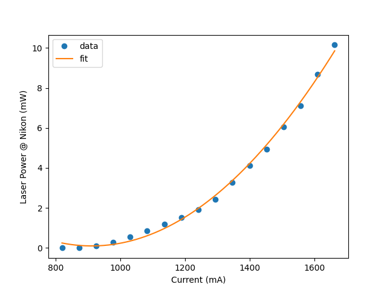
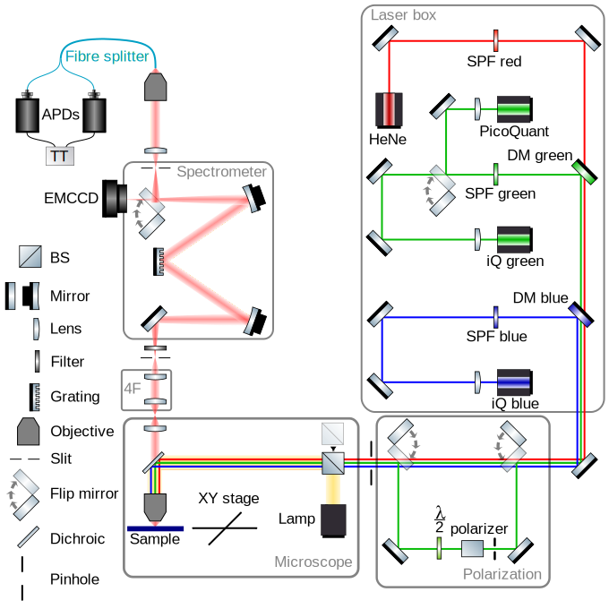

=====
Setup
=====

Main Components
===============

+----------------------+----------------------+---------------------+
| Component            | Model Name           | Supplier            |
+======================+======================+=====================+
| Lamp                 | LHS-H100S-1          | Nikon               |
+----------------------+----------------------+---------------------+
| Microscope           | Eclipse Ti-U         | Nikon               |
+----------------------+----------------------+---------------------+
| XY stage             | MCL-μS2051           | Mad City Labs       |
+----------------------+----------------------+---------------------+
| 4F                   | SR-ASZ-0079          | Andor               |
+----------------------+----------------------+---------------------+
| Spectrometer         | SR-303i              | Andor               |
+----------------------+----------------------+---------------------+
| EMCCD                | Newton DTU970P-BCF   | Andor               |
+----------------------+----------------------+---------------------+
| Fibre splitter       | 10X 0.26 NA          | Mitutoyo            |
| objective            |                      |                     |
+----------------------+----------------------+---------------------+
| Fibre splitter       | TM105R5F1B with APC  | Thorlabs            |
|                      | connectors           |                     |
+----------------------+----------------------+---------------------+
| APD                  | SPCM-AQRH-15-FC      | Excelitas           |
+----------------------+----------------------+---------------------+
| Time Resolution APD  | PDM $PD-100-CTD-FC   | MPD                 |
+----------------------+----------------------+---------------------+
| TT                   | Time Tagger 20       | Swabian Instruments |
+----------------------+----------------------+---------------------+
|                      |                      |                     |
+----------------------+----------------------+---------------------+

Lasers
======

+-----------+-------------------------------------+------------+-------------------+
| Component | Model Name                          | Wavelength | Supplier          |
+===========+=====================================+============+===================+
| HeNe      | HNL210L                             | 633 nm     | Thorlabs          |
+-----------+-------------------------------------+------------+-------------------+
| PicoQuant | LDH-IB-520-B                        | 515 nm     | PicoQuant         |
+-----------+-------------------------------------+------------+-------------------+
| iQgreen   | 0520L-13A                           | 520 nm     | Integrated Optics |
+-----------+-------------------------------------+------------+-------------------+
| iQblue    | 0405L-13A                           | 405 nm     | Integrated Optics |
+-----------+-------------------------------------+------------+-------------------+
| Cobolt    | 08-DPL 532 nm 50 mW fiber pigtailed | 532 nm     | Hübner Cobolt     |
+-----------+-------------------------------------+------------+-------------------+
|           |                                     |            |                   |
+-----------+-------------------------------------+------------+-------------------+

Cobolt Laser Current-Power at Nikon Characteristic
------------------------------------------------------

|cobolt_ip_charact|

Optics
======

Free Space
----------

+------------------+----------------+----------------+----------------+
| Component        | Model Name     | Supplier       | Notes          |
+==================+================+================+================+
| SPF red          | FES0650        | Thorlabs       |                |
+------------------+----------------+----------------+----------------+
| SPF green        | RazorEdge SP   | A              | For more       |
|                  | 532 RU         | nalysentechnik | details ask    |
|                  |                |                | Pooja          |
+------------------+----------------+----------------+----------------+
| SPF blue         | FF01-424/SP-25 | A              |                |
|                  |                | nalysentechnik |                |
|                  |                | (IDEX/Semrock) |                |
+------------------+----------------+----------------+----------------+
| SPF green        | FESH0550       | Thorlabs       | Not used       |
+------------------+----------------+----------------+----------------+
| SPF blue         | FESH0450       | Thorlabs       | Not used       |
+------------------+----------------+----------------+----------------+
| DM green         | DMLP567        | Thorlabs       |                |
+------------------+----------------+----------------+----------------+
| DM blue          | DMLP425        | Thorlabs       |                |
+------------------+----------------+----------------+----------------+
| Protected Silver | PF10-03-P01-10 | Thorlabs       | Ø 1”(25.4 mm)  |
| Mirror, 10 Pack  |                |                |                |
+------------------+----------------+----------------+----------------+
| ND Filters       |                | Thorlabs       |                |
+------------------+----------------+----------------+----------------+
| Motorized        | PRM1Z8         | Thorlabs       | For            |
| rotation stage   |                |                | polarization   |
|                  |                |                | part           |
+------------------+----------------+----------------+----------------+
|                  |                |                |                |
+------------------+----------------+----------------+----------------+

Spectrometer wheel
------------------

The spectrometer has three grating slots, but only two are used: - 150
l/mm, blaze 800 nm - 1200 l/mm, blaze 850 nm

+------------------+----------------+----------------+----------------+
| Component        | Model Name     | Supplier       | Notes          |
+==================+================+================+================+
| empty            |                |                | one slot is    |
|                  |                |                | always empty   |
+------------------+----------------+----------------+----------------+
| ND Filter        | NE30B          | Thorlabs       |                |
+------------------+----------------+----------------+----------------+
| LP               | 420LPET        | A              |                |
|                  |                | nalysentechnik |                |
|                  |                | (Chroma)       |                |
+------------------+----------------+----------------+----------------+
| LP               | RazorEdge LP   | A              | for more       |
|                  | 532 RE         | nalysentechnik | details ask    |
|                  |                |                | Pooja          |
+------------------+----------------+----------------+----------------+
| LP               | FELH0650       | Thorlabs       | check          |
+------------------+----------------+----------------+----------------+
| LP               | FELH0450       | Thorlabs       | check          |
+------------------+----------------+----------------+----------------+
| LP               | FELH0550       | Thorlabs       | currently      |
|                  |                |                | unmounted      |
+------------------+----------------+----------------+----------------+
|                  |                |                |                |
+------------------+----------------+----------------+----------------+

Microscope
----------

+------------------+----------------+----------------+----------------+
| Component        | Model Name     | Supplier       | Notes          |
+==================+================+================+================+
| DM green         | DMLP532R       | Thorlabs       |                |
+------------------+----------------+----------------+----------------+
| DM blue          | DMLP425R       | Thorlabs       |                |
+------------------+----------------+----------------+----------------+
| Beam Splitter    | BSS10R         | Thorlabs       |                |
+------------------+----------------+----------------+----------------+
| Dichroic mount   | TLV-TE2000     | ThorLabs       | Compatible for |
|                  |                |                | NikonEclipse   |
|                  |                |                | Ti-U           |
+------------------+----------------+----------------+----------------+
| Hi               | TU Plan Fluor  | Nikon          |                |
| gh-magnification | 100X/0.9 EPI D |                |                |
| objective        |                |                |                |
+------------------+----------------+----------------+----------------+
| Sample objective | TU Plan ELWD   | Nikon          |                |
|                  | 50X/0.6 EPI D  |                |                |
+------------------+----------------+----------------+----------------+
| L                | LU Plan Fluor  | Nikon          |                |
| ow-magnification | 10X/0.3 WD 15  |                |                |
| objective        |                |                |                |
+------------------+----------------+----------------+----------------+
|                  |                |                |                |
+------------------+----------------+----------------+----------------+

Complete DFM Setup Scheme
==========================

|dfm_pl_setup_scheme.svg|

